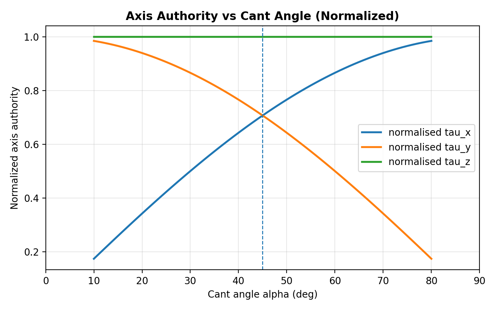
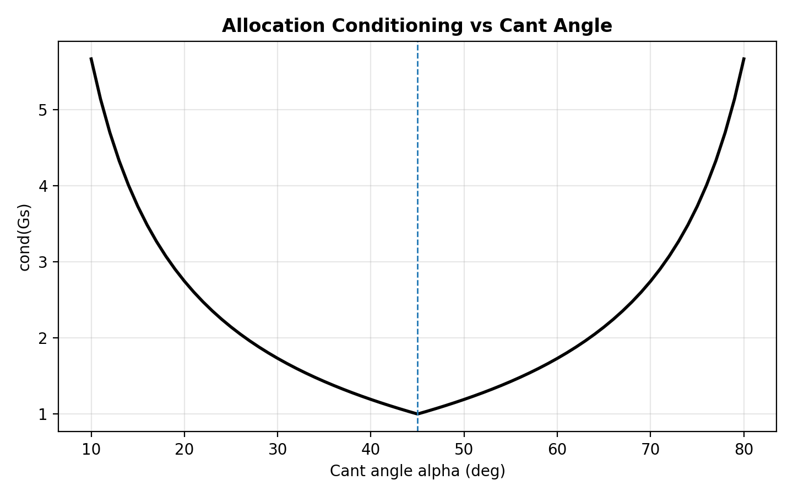

# Setpoint Shaping and Pointing Control for Satellite Repositioning

This document describes the design, analysis, and validation of this GitHub project. Since my background is in Systems and Control, I put extra emphasis on the dynamics and control aspects of the work.

I’ve written this in a conversational style on purpose. The goal isn’t to be a step by step construction manual or a formal academic paper, but to capture my thought process and explain the rationale behind key design decisions.

So if you don’t mind a casual tone and a slightly unconventional writing style, feel free to read on! 😀👍

## Table of Contents

1. [Problem Statement and Requirements](#1-problem-statement-and-requirements)
2. [Spacecraft Physical Model](#2-spacecraft-physical-model)
3. [Reaction Wheel Configuration: Why This Geometry?](#3-reaction-wheel-configuration-why-this-geometry)
4. [Flexible Mode Dynamics: The Base Excitation Problem](#4-flexible-mode-dynamics-the-base-excitation-problem)
5. [From Nonlinear Basilisk Model to Linear Control Design](#5-from-nonlinear-basilisk-model-to-linear-control-design)
6. [Why PD Control? A Transfer Function Analysis](#6-why-pd-control-a-transfer-function-analysis)
7. [Gain Selection: Deriving K and P from Requirements](#7-gain-selection-deriving-k-and-p-from-requirements)
8. [Why Feedforward? The Fundamental Limitation of Feedback](#8-why-feedforward-the-fundamental-limitation-of-feedback)
9. [Why Fourth-Order Shaping? Spectral Analysis](#9-why-fourth-order-shaping-spectral-analysis)
10. [System Integration and Trajectory Tracking](#10-system-integration-and-trajectory-tracking)
11. [Validation and Results](#11-validation-and-results)
12. [Summary of Design Decisions](#12-summary-of-design-decisions)

## 1. Problem Statement and Requirements 

### 1.1 Mission Scenario

A 750 kg spacecraft must perform a $`180 \degree`$ [slew manoeuvre](https://en.wikipedia.org/wiki/Slew_(spacecraft)) about the Z axis in the [body frame](https://www.sbg-systems.com/glossary/body-frame/#:~:text=The%20sensor%20coordinate%20frame%20or,base%2C%20depending%20on%20the%20application.) (i.e., a yaw rotation) within 30 seconds.

In practice, achieving such a manoeuvre within this narrow time window is in the neighbourhood of “keep dreaming,” due to limitations such as [reaction wheel](https://en.wikipedia.org/wiki/Reaction_wheel) torque constraints and disturbances from [slosh dynamics](https://en.wikipedia.org/wiki/Slosh_dynamics), to name just a few. For the purpose of this project, we deliberately disregard these limitations and focus only on the flexible dynamics of the [solar array](https://en.wikipedia.org/wiki/Solar_panels_on_spacecraft), aiming for [arcsecond](https://en.wikipedia.org/wiki/Minute_and_second_of_arc) level post manoeuvre pointing stability to enable high resolution imaging of a comet. 

### 1.2 Core Difficulty 

The spacecraft considered in this project carries flexible solar arrays, which are typically lightly damped. When the spacecraft body accelerates during the slew manoeuvre, these arrays are excited and begin to vibrate.

Because the damping is low, and because, in the space environment, free vibrations have limited ways to dissipate energy (primarily through internal/[(structural damping)](https://innovationspace.ansys.com/courses/wp-content/uploads/2020/12/2.6.2-Fundamentals-of-Damping-New-Template.pdf), the motion can persist well beyond the end of the manoeuvre. In some cases, the resulting residual vibrations can last for minutes.

This residual motion degrades pointing accuracy and can force the spacecraft to wait for the structure to settle before imaging or performing other precision tasks, effectively putting a "brake" on the mission timeline,something engineers generally try hard to avoid.

### 1.3 Requirements

| Requirement | Value | Rationale |
|-------------|-------|-----------|
| Slew angle | 180° | Mission geometry |
| Slew time | 30 s | Operational constraint |
| Post-slew settling | < 5 s to 1 arcsec | Imaging window |
| Residual vibration | < 1 mm modal displacement | Payload requirement 

 *Note:- These requirements are defined solely for this project and do not represent any known ongoing or past mission requirements.*

 

Reasoning as to why this holds.

 ## 2. Spacecraft Model

In this section, we’ll walk through how we build the spacecraft model. We’ll start with the nonlinear model used for simulation, and then move on to the linearised model we’ll use for controller design.

For the higher fidelity setup, we lean on Basilisk’s built in modules, mainly `spacecraft.Spacecraft()` to represent the rigid body hub, `reactionWheelStateEffector` to model the reaction wheels, and `linearSpringMassDamper` to capture the flexible dynamics of the solar arrays. Once those pieces are in place, we attach the state effectors (reaction wheels + solar arrays) to the central hub, and that gives us the full spacecraft model inside Basilisk.

After that, we’ll take a look at the linearised model derived from the nonlinear Basilisk model, since that’s what we’ll use for controller design. Along the way, I’ll also explain the rationale behind the modelling choices and the overall workflow.

*Note:- If curiosity gets the better of you and you decide to wander into Basilisk’s documentation rabbit hole, here are the links to the modules we’re using so you don’t have to hunt them down: [spacecraft](https://hanspeterschaub.info/basilisk/Documentation/simulation/dynamics/spacecraft/spacecraft.html), [reaction wheels](https://hanspeterschaub.info/basilisk/Documentation/simulation/dynamics/reactionWheels/reactionWheelStateEffector.html), and [linear spring-mass-damper](https://hanspeterschaub.info/basilisk/Documentation/simulation/dynamics/LinearSpringMassDamper/linearSpringMassDamper.html).* 😁

### 2.1 Hub Properties
We define our hub as :

$$`m_{hub} = 750 kg \tag{1}`$$

$$I_{hub} = \begin{bmatrix} 900 & 0 & 0 \\ 0 & 800 & 0 \\ 0 & 0 & 600 \end{bmatrix} \text{ kg} \cdot \text{m}^2 \tag{2}$$

The goal here is to pick values for $m_{hub}$ and $I_{hub}$ that are representative of a medium sized satellite. I’ve chosen a *diagonal* inertia tensor on purpose; this corresponds to defining the body frame so it aligns with the hub’s principal axes of inertia, which keeps the rotational dynamics nice and simple.

### 2.2 Euler's Rotational Equations of Motion

To capture the hub’s rigid body dynamics, we use Euler’s rotational equation. In the body frame, the attitude dynamics follow from conservation of angular momentum:

$$I_{hub}\dot{\boldsymbol{\omega}}+\boldsymbol{\omega} \times \left(I_{hub}\boldsymbol{\omega}\right)=\boldsymbol{\tau}_{ext}\tag{3}$$

Here, $I_{hub}$ is the inertia tensor defined above, and $\omega $ and $ \dot\omega$  are the hub’s angular velocity and angular acceleration, respectively.

Expanding the equation into components (for our diagonal inertia tensor):

$$I_{xx}\dot{\omega}_x - (I_{yy}-I_{zz})\omega_y\omega_z = \tau_x \tag{4}$$

$$I_{yy}\dot{\omega}_y - (I_{zz}-I_{xx})\omega_z\omega_x = \tau_y \tag{5}$$

$$I_{zz}\dot{\omega}_z - (I_{xx}-I_{yy})\omega_x\omega_y = \tau_z \tag{6}$$

The terms $(I_{yy}-I_{zz})$ $\omega_y\omega_z$  etc., are the gyroscopic coupling terms. They transfer angular momentum between axes during multi axis rotation.

*Note: I found an interesting reference to angular momentum transfer, and its removal from a spacecraft using gravity gradient moments. Even though its from the late 60's i still found it quiet inetersting. You can find the documentation [here](https://ntrs.nasa.gov/api/citations/19660011641/downloads/19660011641.pdf).*

### 2.3 Modified Rodrigues Parameters (MRPs)

To parameterize our attitude representation, we’ll use [MRPs](https://ntrs.nasa.gov/api/citations/19960035754/downloads/19960035754.pdf) instead of [quaternions](https://en.wikipedia.org/wiki/Quaternions_and_spatial_rotation) or Euler angles. The reason I’m going with MRPs comes down to three main perks:

- Minimal representation : (only 3 parameters)

- No [gimbal lock](https://en.wikipedia.org/wiki/Gimbal_lock) unlike Euler angles 

- Quadratic kinematics : the kinematic equation is a polynomial and not [transcendental](https://en.wikipedia.org/wiki/Transcendental_equation)

So, for a rotation of angle $\Phi$ about an axis $\hat e$ , the MRP can be computed as :

$$\boldsymbol{\sigma} = \hat{\mathbf{e}} \tan\left(\frac{\Phi}{4}\right) \tag{7}$$

*Note:- notice how MRPs are computed? we can leverage this formula to force a small angle approximation to linearise our plant to design our control system down the lane.*

With the MRP computation now defined, we’ll leverage the MRP representation and define the [kinematic differential equation](https://digitalcommons.odu.edu/cgi/viewcontent.cgi?article=1374&context=mae_etds)  as:

$$

\dot\sigma = \frac{1}{4} B(\sigma)\omega \tag{8}

$$

Where:

$$

B(\sigma)=(1-\sigma^2)I_3 + 2[\sigma_\times]+2\sigma\sigma^T \tag{9}

$$

and as we surely recall from vector algebra lectures that:

$$
 \sigma^2 = \sigma^T\sigma \tag{10}
 
$$

## 3. Reaction Wheels

Alright , now that the hub model is out of the way, we can start building our first `StateEffector`. This one is also the main (and basically *only*) actuator we’ll use in this project; the reaction wheels.

Reaction wheels let the spacecraft rotate by exploiting conservation of angular momentum. In simple terms, spinning a wheel inside the spacecraft causes the spacecraft body to rotate in the opposite direction about the same axis!. If you want a quick visual for what’s going on, i feel this [YouTube Short](https://www.youtube.com/shorts/oaGZo1ZVw7g) explains it nicely.

### 3.1 Torque Source

To characterize the reaction wheels and how they influence the spacecraft’s rotation, we model them as a torque source. That said, we *don’t* treat them as an ideal torque actuator as we explicitly account for the wheel/rotor inertia.

With that in mind, the torque produced by the \(i\) th reaction wheel can be written as:

$$

\tau_{RW,i} = -J_{s,i} \dot\Omega_i \hat g_{s,i} \tag{11}

$$

Here, $ J_s$ is the rotor inertia and  $ \Omega_i$ is the wheel spin rate, so the inertia matrix becomes:

$$

J_s = \begin{bmatrix} 0.05 & 0 & 0 \\ 0 & 0.05 & 0 \\ 0 & 0 & 0.05 \end{bmatrix} kg \cdot m^2 \tag{12}

$$

Using this, the total torque from the full reaction wheel set can be expressed as:

$$

\tau_{RW} = -G_s J_s \dot\Omega \tag{13}
$$

This can be rewritten more compactly as:

$$
\tau_{RW} = -G_su_{motor}\tag{14}

$$

where $u_{motor} $ = $ J_s\dot\Omega $ is the vector of motor torques.

Since $ G_s $ is the spin axis matrix defined by:

$$\mathbf{G}_s = \begin{bmatrix} | & | & | \\ \hat{\mathbf{g}}_{s1} & \hat{\mathbf{g}}_{s2} & \hat{\mathbf{g}}_{s3} \\ | & | & | \end{bmatrix} \tag{15}

$$

we can see from (14) that the torque we get depends directly on how we choose the wheel spin axes. So before we go any further, we need to pick those axes 
which brings us to our first real design decision 🤓.

### 3.2 Actuator Alignment 

To figure out the best way to orient our reaction wheels, we first need to understand how the wheel geometry affects both the spacecraft’s control authority and the numerical behaviour of our allocation. And honestly, what better way to build that intuition than running a parameter sweep, right 😀?

Before we run the sweep, I’m going to explicitly align one wheel with the body Z axis. The main reason is simple; our big repositioning manoeuvre is about Z (yaw), so having one wheel dedicated to the Z axis gives us clean, direct authority on the exact axis we care about most. That leaves the orientation of the other two wheels as the real design choice.

Lets properly write out our spin axis matrix $ G_s$ from eq (15), so we get:

$$

G_s = \begin{bmatrix} + sin(\alpha) & - sin(\alpha) & 0 \\ + cos(\alpha) & + cos(\alpha) & 0 \\ 0 & 0 & 1 \end{bmatrix} \tag{16}

$$

From this matrix, we can see that the wheel aligned with the body Z axis has full control authority in Z, and contributes no torque about the body X and Y axes. For the other two wheels, we deliberately share control authority over the XY plane, so we don’t end up relying on a single wheel for a single axis (which helps reduce individual wheel effort by spreading the load).

Notice how the cosine terms are both positive; this is intentional. The X axis authority comes from the difference in wheel torques (because the X components are opposite), while the Y axis authority comes from the sum (because the Y components are the same and positive).

Suppose you had flipped one cosine term to negative, you’d effectively point one wheel toward \(-Y\), and the Y components would start cancelling out. That would reduce your Y authority, which is not what we want.

Now we pick our rotation axes angles $ \alpha $, based on the following paramteres:

- [Condition number](https://en.wikipedia.org/wiki/Condition_number) of the allocation matrix $G_sG_s^T $ : We aim for a lower condition number as it represents better numerical conditioning and more isotropic control.

- Axis wise torque autority: we compute the max body torque achievable along X and Y for a fixed wheel torque limit, since the control authority changes with the angle $ \alpha$ 

With our parameter sweep now complete, we analyse the results given in the figures below:

  
  

$\newline$

After analysing the plots, we quickly notice that the a cant angle ($ \alpha$) of $ 45\degree$ has the lowest conditioning number. Furthermore, we also notice that the same $ \alpha$ value gives equal torque authority along both the X and Y axes (for the same wheel torque limit).

*Note:- Equal X/Y authority gives a more uniform control capability over the XY plane, which makes [gain balancing](https://patentscope.wipo.int/search/en/WO2024245715) a lot less painful (the effort is naturally shared).*

Thus from these analyses, we decide our cant angle to be set to $\alpha = 45 \degree$

Hence the spin axis matrix $ G_s$ becomes:

$$\mathbf{G}_s = \begin{bmatrix} \frac{\sqrt{2}}{2} & -\frac{\sqrt{2}}{2} & 0 \\ \frac{\sqrt{2}}{2} & \frac{\sqrt{2}}{2} & 0 \\ 0 & 0 & 1 \end{bmatrix} \tag{17}$$

With the spin axis determined, we ask ourselves " can this orientation enable control on all three axises?" or more mathematically, " can the torque mapping span $ \mathbb{R}^3 ?$ . we answer this by looking at the rank of this matrix.

For full 3 axis attitude control, the reaction wheel spin axes must span $\mathbb{R}^3$. Mathematically, the spin axis matrix from eq (15):

$$\mathbf{G}_s = \begin{bmatrix} | & | & | \\ \hat{\mathbf{g}}_{s1} & \hat{\mathbf{g}}_{s2} & \hat{\mathbf{g}}_{s3} \\ | & | & | \end{bmatrix}$$

must have rank 3 (be invertible for a 3 wheel system).

Let's verify our configuration:

$$\mathbf{G}_s = \begin{bmatrix} \frac{\sqrt{2}}{2} & -\frac{\sqrt{2}}{2} & 0 \\ \frac{\sqrt{2}}{2} & \frac{\sqrt{2}}{2} & 0 \\ 0 & 0 & 1 \end{bmatrix}$$

Computing the determinant:

$$\det(\mathbf{G}_s) = 1 \cdot \det\begin{bmatrix} \frac{\sqrt{2}}{2} & -\frac{\sqrt{2}}{2} \\ \frac{\sqrt{2}}{2} & \frac{\sqrt{2}}{2} \end{bmatrix} = 1 \cdot \left(\frac{1}{2} + \frac{1}{2}\right) = 1 \tag{18}$$

Since $\det(\mathbf{G}_s) = 1 \neq 0$, the system has full 3 axis controllability.

*Note :- In many spacecraft, reaction wheels are mounted rigidly (body fixed). Systems that use gimbals to reorient a spinning actuator are more commonly referred to as control moment gyros ([CMGs](https://en.wikipedia.org/wiki/Control_moment_gyroscope)), or gimballed wheel setups. In this simulation, the reaction wheels are assumed to be fixed at a canted orientation, so there is no gimbal and no controllability over the wheel spin axis direction. therefore only the wheel torque is commanded.*

## 4 Flexible Mode Dynamics

With the reaction wheels now set up and the cant angle locked in, we can move on to our second `StateEffector`; the flexible solar arrays. As shown in the figure below, the arrays are mounted along the body Y axis.

Now, the sketch isn’t exactly a work of art 😅, but it does the job! it shows where the [modal mass](https://www.sciencedirect.com/topics/engineering/modal-mass) is located and how far it sits from the spacecraft hub. In this section, we’ll dig into why the arrays get excited (and start vibrating) during a slew, we’ll try (our best!) to figure out which axis the dominant vibration shows up on, and finally we’ll look at how the `LinearSpringMassDamper` module models the array dynamics.

<image src = "image-2.png" width = 600>

### 4.1 Effects of Slew Manoeuvre on Array Vibration

To get an intuition for what the slew does to the arrays, let’s momentarily pretend the hub is a perfectly rigid rotating body. When the hub rotates, any point attached to it experiences inertial (absolute) acceleration.

Consider a point on the array located at

$$
r = \begin{bmatrix} 0 & r_y & 0 \end{bmatrix}^T
$$

i.e., it sits a distance $r_y $ away from the hub center along the body \(Y\) axis.

The absolute acceleration of this point is:

$$
\ddot r_{abs} = \dot \omega \times r + \omega \times (\omega \times r ) \tag{19}
$$

For a pure yaw rotation $ \omega = [0,0,\omega_z]^T $ (which is exactly the kind of motion we have during the slew), the tangential term becomes:

$$
\dot \omega \times r = \begin{bmatrix} 0 \\ 0 \\ \dot \omega_z \end{bmatrix} \times \begin{bmatrix} 0 \\ r_y \\ 0 \end{bmatrix} =  \begin{bmatrix} -\dot \omega_z r_y \\ 0 \\ 0 \end{bmatrix} \tag{20}
$$

And the centripetal acceleration is:

$$
\boldsymbol{\omega} \times (\boldsymbol{\omega} \times \mathbf{r}) = \begin{bmatrix} 0 \\ -\omega_z^2 r_y \\ 0 \end{bmatrix} \tag{21}
$$

Notice what (20) is telling us? the tangential acceleration points along the body \(X\) axis (perpendicular to both the rotation axis \(Z\) and the array direction \(Y\)). Intuitively, when the hub accelerates in yaw, it “drags” the array attachment points sideways in the tangential direction. The array tip has inertia, so it can’t follow instantly and it lags behind, the array bends, and that’s how the vibration starts.

*Note :- By looking at the phenomenon above, we can  frame it as a [base excitation problem](https://community.wvu.edu/~bpbettig/MAE340/Lecture_2_4_Base_excitation.pdf). This is a classic concept taught in the " Advanced Vibration " course modules.*

### 4.2 Modal Equation of Motion

In the previous subsection we saw why the slew excites the solar array. Now let’s talk about how we can characterise that vibration.

A super common way to do this is to approximate the flexible motion with a [mass spring damper model](https://en.wikipedia.org/wiki/Mass-spring-damper_model). It’s not trying to capture every tiny structural detail, but it does a great job at capturing the stuff we actually care about! the vibration frequency, the amplitude of the response (for a given excitation), and how fast the oscillations die out thanks to damping.

For a modal coordinate $ \rho$, we form our equation of motion as:

$$

m\ddot\rho + c \dot \rho + k \rho = F_{excitation} \tag{22}

$$

where:
- $\rho$ is the modal displacement (bending deflection)
- $m$ is the effective modal mass
- $c = 2\zeta\omega_n m$ is the damping coefficient
- $k = \omega_n^2 m$ is the spring stiffness
- $F_{excitation}$ is the basen excitation (inertial) forcing term

The excitation comes from the tangential base acceleration during the yaw slew. Using $a_{tangential} = -\dot{\omega}_z r_y$ (from Eq. (20)), the equivalent inertial forcing can be written as:

$$F_{excitation} = -m \cdot a_{tangential} = -m \cdot (-\dot{\omega}_z r_y) = m \cdot r_y \cdot \dot{\omega}_z \tag{23}$$

for yaw manoeuvre (so we can neglect the cross coupling term in Eq. (6)), we use:

$$\dot{\omega}_z = \tau_z / I_{zz}$$

and substitute into the modal equation:

$$m\ddot{\rho} + c\dot{\rho} + k\rho = \frac{m \cdot r_y}{I_{zz}} \cdot \tau_z \tag{24}$$

Dividing by $m$ gives the standard second order form:

$$\ddot{\rho} + 2\zeta\omega_n\dot{\rho} + \omega_n^2\rho = \frac{r_y}{I_{zz}} \cdot \tau_z \tag{25}$$

This reveals the modal gain:

$$G_{modal} = \frac{r_y}{I_{zz}} \tag{26}$$

### 4.4 Modal Parameters

| Mode | Frequency $f_n$ | $\omega_n$ (rad/s) | Damping $\zeta$ | Lever Arm $r$ | Modal Gain |
|------|-----------------|-------------------|-----------------|---------------|------------|
| 1 | 0.4 Hz | 2.51 | 0.02 | 3.5 m | 0.0056 |
| 2 | 1.3 Hz | 8.17 | 0.015 | 4.5 m | 0.0073 |

*Note :- i picked the modal parameters to roughly represent a large solar array. In general, big arrays tend to have very low natural frequencies. Also, pure material (structural) damping is usually quite small, but in real hardware the attachment points, fasteners, and joints add a bit of extra damping. Taking all that into account, a damping ratio in the ballpark of 0.01 to 0.02 is what I kept seeing during my literature review. If you think I’ve overestimated the damping, please reach out! I’m happy to revisit it and update both this documentation and the codes 👍*

### 4.5 Settling Time for A Second Order Oscillator

Since we’ve modelled the vibration as a second order mass spring damper system, we can estimate its settling time using a standard percent criterion. The most common choices are the 2% or 5% settling time definitions. For this project, I’ll use the 2% criterion, which gives the well known approximation:

$$t_s \approx \frac{4}{\zeta \omega_n} \tag{27}$$

For Mode 1 ($\zeta = 0.02$, $\omega_n = 2.51$ rad/s):

$$t_s \approx \frac{4}{0.02 \times 2.51} = \frac{4}{0.05} = 80 \text{ seconds} \tag{28}$$

So yeah… this mode takes on the order of 80 seconds to settle, which is more than twice our slew time! That’s exactly why we’d like to avoid (as much as possible) exciting these flexible mode frequencies during the manoeuvre.

*Note :- if you are wondering about the second mode, the settling time is around 24.48 seconds!*

## 5 Linearization of The Spacecraft Model

The Basilisk simulation is running the full nonlinear model, which includes:

1. **Nonlinear kinematics**: $\dot{\boldsymbol{\sigma}} = \frac{1}{4}\mathbf{B}(\boldsymbol{\sigma})\boldsymbol{\omega}$
2. **Gyroscopic coupling**: $\boldsymbol{\omega} \times \mathbf{I}\boldsymbol{\omega}$
3. **Reaction wheel momentum**: the wheel angular momentum contributes to (and couples into) the total spacecraft momentum
4. **Flexible mode coupling**: the flexible modes exchange momentum with the hub

Which naturally leads to the next question, under what conditions can a linearised version of this model still do a decent job of matching the real behaviour?

My take is pretty straightforward here. linearisation works best when the nonlinear terms either vanish entirely or become small enough to ignore. So the game plan is to figure out when that happens, and then design our controller around that linearised plant.

### 5.1 Principal Axis Rotation and Gyroscopic Coupling

Since our slew manoeuvre is about the body Z axis, it’s worth checking what that does to the gyroscopic coupling terms. To do that, let’s look at eq. (6):

$$I_{zz}\dot{\omega}_z - (I_{xx} - I_{yy})\omega_x\omega_y = \tau_z$$

Now, if we enforce a pure yaw motion by setting $ \omega_x \omega_y = 0 $ (i.e., no roll/pitch rotation), the coupling term drops out and we’re left with:

$$ I_{zz} \dot \omega_z = \tau_z$$

And importantly, this isn’t an approximation, it’s exact! So for a yaw only manoeuvre (assuming we don’t pick up roll/pitch motion from disturbances or coupling), the Z axis dynamics are perfectly linear!

### 5.2 Small Angle Approximation of MRP Kinematics

To see if we can perform a small angle approx of MRP kinematics, we refer to eqs (8) & (9), and we write:

$$\dot{\boldsymbol{\sigma}} = \frac{1}{4}\left[(1 - \sigma^2)\mathbf{I}_3 + 2[\boldsymbol{\sigma}\times] + 2\boldsymbol{\sigma}\boldsymbol{\sigma}^T\right]\boldsymbol{\omega}$$

For small $|\boldsymbol{\sigma}|$ (small attitude errors):

$$\dot{\boldsymbol{\sigma}} \approx \frac{1}{4}\boldsymbol{\omega}$$

So this has linearised our kinematics!

*Note :- This actually highlights an important constraint for our controller design. the small angle (linearised) plant only behaves linear when the attitude errors stay small. So we can’t expect a small angle linear feedback controller to take us from a huge initial error (like a 180° slew) all the way to the target by itself! that’s way outside the region where the linear model is valid.*

*Instead, we use a tracking setup. a feedforward generates an instantaneous reference trajectory (and the corresponding torque/motion profile), and the feedback controller’s job is mainly to correct small deviations around that trajectory. In other words, the feedforward does the heavy lifting, and the feedback keeps us on the rails!*

### 5.3 Linearized Model

Combining the above:

**Dynamics:**
$$I_{zz}\dot{\omega}_z = \tau_z$$

**Kinematics (single axis):**
$$\dot{\sigma}_z = \frac{1}{4}\omega_z$$

Taking Laplace transforms:

$$sI_{zz}\Omega(s) = T(s) \tag{29}$$
$$s\Sigma(s) = \frac{1}{4}\Omega(s) \tag{30}$$

Eliminating $\Omega(s)$:

$$\Sigma(s) = \frac{1}{4s}\Omega(s) = \frac{1}{4s} \cdot \frac{T(s)}{sI_{zz}} \tag{31}$$

$$G_{rigid}(s) = \frac{\Sigma(s)}{T(s)} = \frac{1}{4I_{zz}s^2} \tag{32}$$

This is basically a double [integrator](https://electronics.stackexchange.com/questions/333888/why-is-the-frequency-domain-representation-of-an-integrator-1-s)! two poles sitting at the origin. In frequency domain terms, it carries about $180 \degree$ of phase lag right out of the gate, which is not unstable by itself (it’s marginal in open loop), but it definitely makes the feedback design a tad bit more challenging.

*Note :- As you’ve probably already guessed, I’m a little biased toward frequency domain control (life is just easier here) 😄*

### 5.4 Flex Modes to Plant 

For each flexible mode, the transfer function from torque to modal displacement is:

$$\frac{P_i(s)}{T(s)} = \frac{G_{modal,i}}{s^2 + 2\zeta_i\omega_{n,i}s + \omega_{n,i}^2} \tag{33}$$

The complete plant from torque to attitude includes the coupling:

$$G_{flex}(s) = \frac{1}{4I_{eff}s^2} \cdot \prod_{i=1}^{N_{modes}} \frac{s^2 + 2\zeta_i\omega_i s + \omega_i^2 + \Delta_i}{s^2 + 2\zeta_i\omega_i s + \omega_i^2} \tag{34}$$

where $I_{eff}$ includes the effective inertia from modal masses, and $\Delta_i$ represents the anti resonance shifts from coupling.

So yeah, in the Bode plot of our flexible plant (torque $\rightarrow$ attitude) below, you can clearly spot both the resonance and the anti resonance.

<image src = "image-3.png" width = 500>

$\newline$

*Note :- notice how the anti resonance shows up before the resonance? this is because our plant model is [collocated](https://www.pml.uliege.be/wp-content/uploads/2022/07/1-s2.0-S0888327022006082-main.pdf). So, each flexible mode introduces a zero (anti resoannce) slightly below its pole (resonance)*

## 6 Feedback Control Design

Before we pick a controller, let’s first get a feel for the basic properties of the plant:

| Property | Value |
|----------|-------|
| Magnitude at DC | $\infty$ (two poles at the origin) |
| Magnitude slope | -40 dB/decade (away from flexible modes) |
| Phase | $\approx -180°$ (away from resonance/anti resonance) |
| Gain margin | Not very informative in the usual sense (the phase sits near $-180°$ for most frequencies, and flexible mode distort the standard crossover picture) |

Now, if we drive this plant with a sinusoid at a frequency that’s not near a flexible mode, the output will be roughly shifted by $-180\degree$. In plain english, the plant mostly behaves like a sign inversion, except around the resonance/anti resonance neighbourhood where the flexible dynamics take over.

### 6.1 Nyquist Stability Criteria

Now that we have a decent feel for the plant and its key quirks, we can look at how to stabilise this (double integrator) system. More precisely, we want to choose a controller such that the open loop transfer function

$$
L(s) = G_{flex}(s) C(s) \tag{35}
$$

does not encircle the point $(-1,0)$ in the complex plane.

Away from the flexible modes, the double integrator part of the plant contributes roughly $-180°$ of phase. So at the gain crossover frequency $\omega_c$ (where $|L(j\omega_c)| = 1$), we can write:

$$\angle L(j\omega_c) = \angle C(j\omega_c) - 180° \tag{36}$$

For a stable closed loop system we want a positive phase margin, i.e.:

$$PM = 180° + \angle L(j\omega_c) > 0 \tag{37}$$

which (under the double integrator phase assumption) boils down to:

$$\angle C(j\omega_c) > 0$$

This means that we need a controller that provides a phase lead! and points us in the direction of using a derivative term (natural phase lead!)

