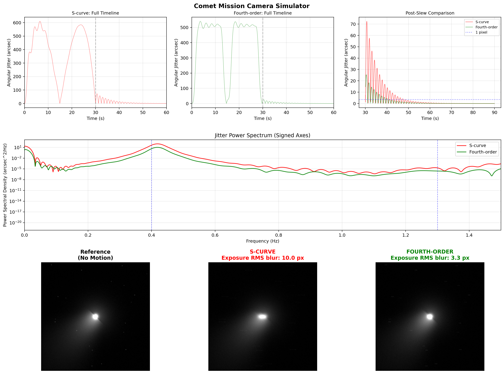

# Setpoint Shaping and Pointing Control for Satellite Repositioning  

**[▶️ Watch: 180° slew simulation in Vizard](Screen%20Recording%202026-02-11%20164011.mp4)** *(Click to download and view)*

This project is a Basilisk simulation framework for spacecraft attitude control that demonstrates how jerk and snap limited setpoint shaping can reduce residual vibrations in flexible structures during rapid slew manoeuvres. The project implements an  GNC workflow from nonlinear plant modeling to Monte Carlo mission analysis to enable a spacecraft to perform 180° slew in 30 s with flexible solar arrays, while maintaining sub 7 arcsecond pointing stability within 60s of post slew, for the improvement of comet imaging resolution.

The control architecture is designed to address the mission requirements as given:

| Requirement | Value | 
|-------------|-------|
| Slew angle | 180° |
| Slew time | 30 s |
| Post slew settling |  RMS ≤7 arcsec (within 60s) |
| Post slew array acceleration | RMS < 10 $`mm/s^2`$  |
|Phase margin | 75°|

> **Note**: For the full design, analysis, derivations, and trade studies, see the **[Design Report](Docs/design_report.md)**.

---

## 🧩 Features

- **Nonlinear Dynamics**: 6 DOF simulation including rigid hub, 3 canted reaction wheels, and flexible solar array modes (modeled in [Basilisk](https://hanspeterschaub.info/basilisk/)).
- **Setpoint Shaping & Feedforward Control**: Implements S curve (**quintic polynomial**) as baseline and Fourth Order  (jerk&snap limited) motion profiles to reduce excitation of array resonant frequencies.
  <details>
  <summary>Click to view motion profiles</summary>
  
  <p align="center">
  
  </p>
  </details>
- **Feedback Control**: MRP based PD feedback loop tuned for 
instantaneous trajectory tracking and limited active damping capabilities.
- **Validation Suite**:
  - Monte Carlo simulation framework.
  - Parameter sensitivity study.
  - Blur estimation through long exposure camera model.
- **Visualization**: Vizard 3D simulation scripts.

---

## 🎯 Performance Snapshot

The mission simulation compares an S-curve motion profile as baseline against the custom fourth order shaped motion profile.

| Metric | S-Curve (Baseline) | Fourth order | Improvement |
|---|---|---|---|
| **RMS Pointing Error** | 12.96 arcsec | **4.65 arcsec** | **64% reduction**  |
| **RMS Array Acceleration** | 1.56 mm/s² | **0.45 mm/s²** | **71% reduction** |
| **Imaging Blur** | 10 px | **3.3 px** | **~70% reduction** |

<p align="center">
  
  <br>
  <em>Figure: Optical paylod jitter model.</em>
</p>

### Robustness
In a 500 run Monte Carlo analysis with ±20% parameter variations, the fourth order setpoint shaping technique showed considerable imporvements in post slew pointing stability and array vibrations while satisfying mission requirements in 86.7% of Monte Carlo runs. 

<p align="center">
  
  <br>
  <em>Figure: Monte Carlo simulation.</em>
</p>


| Metric | S-Curve (Baseline) | Fourth order | Results |
|---|---|---|---|
| **Pass Rate** | 0.0 % | **86.7 %** | **+86.7 points** |
| **Pointing Error (Mean)** | 19.75 arcsec (P95: 27.91) | **3.70 arcsec** (P95: 5.14) | **~5x better** |
| **Vibration (Mean)** | 0.59 mm (P95: 0.84) | **0.26 mm** (P95: 0.36) | **~2.2x better** |
| **Peak Torque (Mean)** | 16.9 Nm | **18.9 Nm** | *~1.2x higher* |

---

## 📂 Repository Structure

```text
basilisk_simulation/
├── src/basilisk_sim/                # Core simulation library
│   ├── spacecraft_properties.py     #   Physical constants, inertia, modal parameters
│   ├── spacecraft_model.py          #   Basilisk FlexibleSpacecraft model builder
│   ├── feedforward_control.py       #   Trajectory shaping (S-curve, fourth-order)
│   ├── feedback_control.py          #   MRP-based PD controller
│   ├── design_shaper.py             #   ZV/ZVD/ZVDD/EI shaper design
│   ├── state_estimator.py           #   Navigation filter
│   ├── star_camera_simulator.py     #   Star tracker model
│   └── comet_camera_simulator.py    #   Comet imaging & blur analysis
│
├── scripts/
│   ├── run_vizard_demo.py           # Run slew simulation (+ optional Vizard 3-D view)
│   ├── run_mission.py               # Post process trajectories → plots & CSV metrics
│   ├── run_survey_scenario.py       # Step and stare survey framing
│   └── regenerate_data.py           # Batch regenerate all trajectory data
│
├── analysis/
│   ├── monte_carlo_factor_sweeps.py # One factor at a time sensitivity sweeps
│   ├── validation_mc_runner.py      # Full Monte Carlo verification & validation
│   ├── rw_cant_sweep.py             # Reaction wheel cant angle trade study
│   └── plot_*.py                    # Plotting helpers for sweep / MC results
│
├── Docs/
│   ├── design_report.md             # Full derivations, analysis & discussion
│   └── plots/                       # Figures referenced by the report and this README
│
├── data/trajectories/               # Reference trajectories & simulation .npz files
├── output/                          # Generated plots, metrics CSVs & MC outputs
├── setup.py
├── pytest.ini
└── LICENSE                          # MIT
```

---

## 🔌 Getting Started

### Prerequisites

| Dependency | Notes |
|---|---|
| **Python 3.10+** | |
| **[Basilisk](https://hanspeterschaub.info/basilisk/)** | Spacecraft dynamics simulation framework |
| NumPy, SciPy, Matplotlib | Installed automatically via `pip` |
| **Vizard** *(optional)* | For interactive 3-D mission visualisation |

### 1. Clone the repository

```bash
git clone https://github.com/TheControlEngineer/spacecraft_input_shaping.git
cd spacecraft_input_shaping/basilisk_simulation
```

### 2. Create and activate a virtual environment

```bash
python -m venv venv_basilisk
```

**Windows PowerShell:**
```powershell
.\venv_basilisk\Scripts\Activate.ps1
```

**macOS / Linux:**
```bash
source venv_basilisk/bin/activate
```

### 3. Install dependencies

```bash
python -m pip install --upgrade pip
pip install -e ".[basilisk]"
```

---

## 🧪 Usage

All commands below assume you are inside `basilisk_simulation/` with the virtual environment activated.

### A. Generate mission trajectories

```bash
# S-curve baseline
python scripts/run_vizard_demo.py s_curve --controller standard_pd --mode combined --output-dir data/trajectories

# Fourth-order shaped
python scripts/run_vizard_demo.py fourth --controller standard_pd --mode combined --output-dir data/trajectories
```

### B. Run mission analysis (plots + metrics)

```bash
python scripts/run_mission.py --data-dir data/trajectories
```

Outputs are saved to `output/plots/` and `output/metrics/`.

### C. Run sensitivity sweeps

```bash
python analysis/monte_carlo_factor_sweeps.py --samples 500 --out-dir output/mc_sweep_500
```

### D. Run verification & validation

```bash
python analysis/validation_mc_runner.py --verification --validation --output-dir analysis
```


---

## 📖 Design Report

The full engineering write up, derivations, modelling assumptions, controller rationale, frequency-domain analysis, and result interpretation is in:

> **[`Docs/design_report.md`](Docs/design_report.md)**

---

## ⚖️ License

This project is licensed under the [MIT License](LICENSE).

## 👤 Author

**[Jomin Joseph Karukakalam](https://www.linkedin.com/in/jomin-joseph-karukakalam-601955225)**
